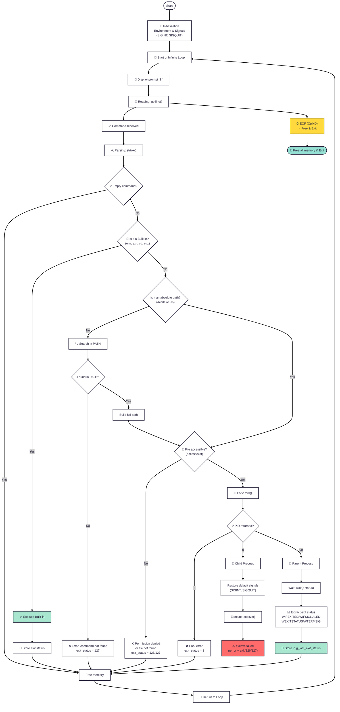

Simple Shell
Simple Shell is a simple UNIX command language interpreter that reads commands from either standard input or from a file. It is a Holberton School project designed to implement a basic shell similar to the sh (Bourne Shell) interface.

Table of Contents
*(#description) *(#requirements) *(#file-structure)

Installation

*(#built-in-commands)

Description
The Simple Shell is a command-line interpreter developed in C. It operates by creating a child process for each command entered by the user. The shell manages the environment variables, handles the PATH variable to locate executables, and supports basic error handling. It is designed to be memory-efficient and robust, handling end-of-file (EOF) conditions and signals like SIGINT (Ctrl+C) gracefully.

Key features include:

Displaying a prompt and waiting for user input.

Executing commands found in the system PATH or via absolute paths.

Handling command-line arguments.

Managing the process environment.

Implementing built-in commands like exit and env.

Requirements
Operating System: Ubuntu 14.04 LTS or 20.04 LTS.

Compiler: GCC 4.8.4 or later.

Compilation Flags: -Wall -Werror -Wextra -pedantic -std=gnu89

Style: Code must follow the Betty style guide.

Memory: No memory leaks (checked with Valgrind).

File Structure
The project is modularized to comply with the limit of 5 functions per file.

Installation
To install and compile the shell, follow these steps:

Clone the repository:

Navigate to the directory:

Compile the program:

Usage
The shell works in two modes: Interactive and Non-Interactive.

Interactive Mode
Run the executable. The shell will display a prompt (e.g., $ or #cisfun$ ) and wait for a command.

Non-Interactive Mode
Pipe commands into the shell or run from a script. The prompt is not displayed.

Built-in Commands
The shell supports the following built-in commands:

Flowchart

Start: Initialize environment.

Loop: Enter infinite loop.

Prompt: Check isatty; if true, print prompt.

Read: Get input line using getline. If EOF, exit.

Parse: Split line into tokens.

Check: Is the command a built-in?

Yes: Execute built-in function.

No: Search PATH or check absolute path.

Fork: Create child process.

Child: execve the command.

Parent: wait for child to finish.

Repeat: Free memory and return to Prompt.

Authors
Contributor 1 -

Contributor 2 -
