# Simple Shell
Simple Shell is a simple UNIX command language interpreter that reads commands from either standard input or from a file. It is a Holberton School project designed to implement a basic shell similar to the sh (Bourne Shell) interface.


## Summary
- [Description](#description)
- [Built-in](#built-in-commands)
- [Features](#Features)
- [Allowed Functions & Rules](#Allowed-Functions-&-Rules)
- [Process-Management](#process-management--logic)
- [Structure-project](#Structure-project)
- [Flowchart](#flowchart)
- [Installation](#installation)
- [Memory Management](#Memory-Management)
- [Documentation_Man_Page](#Documentation_man_page)
- [Technologies used](#technologies-used)
- [Authors](#authors)

---

## Description

The Simple Shell is a command-line interpreter developed in C. It operates by creating a child process for each command entered by the user. The shell manages the environment variables, handles the PATH variable to locate executables, and supports basic error handling. It is designed to be memory-efficient and robust, handling end-of-file (EOF) conditions and signals like SIGINT (Ctrl+C) gracefully.

Usage
The shell works in two modes: Interactive and Non-Interactive.

Interactive Mode
Run the executable. The shell will display a prompt (e.g., $ or #cisfun$ ) and wait for a command.
exemple: 
```
$ ./hsh
($) /bin/ls
hsh main.c shell.c
($) exit
```

Non-Interactive Mode
Pipe commands into the shell or run from a script. The prompt is not displayed.
exemple:
```
$ echo "/bin/ls" | ./hsh
hsh main.c shell.c
```

---

## Built-in-Commands

The shell supports the following built-in commands that are executed directly by the shell process:

| Command | Description |
| --- | --- |
| **exit** | Terminates the shell. You can also provide an exit status (e.g., `exit 98`). |
| **env** | Prints the current environment variables to the standard output. |

---

## Features
* Display a prompt and wait for user input.
* Handle command lines with arguments.
* Handle the PATH environment variable.
* Built-ins: `exit`, `env`.
* Handle `Ctrl+D` (EOF) and `Ctrl+C` (SIGINT).

---

## Allowed-Functions-&-Rules
* Style: Code must follow the Betty style guide.
* File Structure: The project is modularized to comply with the limit of 5 functions per file.
* List of allowed functions:
- all functions from string.h
- access (man 2 access)
- chdir (man 2 chdir)
- close (man 2 close)
- closedir (man 3 closedir)
- execve (man 2 execve)
- exit (man 3 exit)
- _exit (man 2 _exit)
- fflush (man 3 fflush)
- fork (man 2 fork)
- free (man 3 free)
- getcwd (man 3 getcwd)
- getline (man 3 getline)
- getpid (man 2 getpid)
- isatty (man 3 isatty)
- kill (man 2 kill)
- malloc (man 3 malloc)
- open (man 2 open)
- opendir (man 3 opendir)
- perror (man 3 perror)
- printf (man 3 printf)
- fprintf (man 3 fprintf)
- vfprintf (man 3 vfprintf)
- sprintf (man 3 sprintf)
- putchar (man 3 putchar)
- read (man 2 read)
- readdir (man 3 readdir)
- signal (man 2 signal)
- stat (__xstat) (man 2 stat)
- lstat (__lxstat) (man 2 lstat)
- fstat (__fxstat) (man 2 fstat)
- strtok (man 3 strtok)
- wait (man 2 wait)
- waitpid (man 2 waitpid)
- wait3 (man 2 wait3)
- wait4 (man 2 wait4)
- write (man 2 write)

---

## #process-management--logic

The shell operates by managing the lifecycle of processes to execute user commands without crashing or exiting unexpectedly.

### 1. The Main Loop
The shell runs in a continuous loop, performing the following steps:
* **Prompt**: Displays a prompt (if in interactive mode).
* **Read**: Captures user input using `getline()`.
* **Parse**: Tokenizes the input string into a command and its arguments using `strtok()`.
* **Execute**: Attempts to run the command.

### 2. Fork, Execve, and Wait
To execute a command, the shell creates a new process so that the main program doesn't terminate after a command finishes:
* **`fork()`**: Creates a child process. Both the parent and child continue from the same point.
* **`execve()`**: Called within the child process to replace the current process image with the program to be executed (e.g., `/bin/ls`).
* **`wait()`**: The parent process waits for the child to finish, capturing its exit status before displaying the prompt again.

### 3. Environment & PATH
If the user provides a command name (like `ls`) instead of a full path (like `/bin/ls`), the shell:
1.  Retrieves the `PATH` variable from the environment.
2.  Splits the `PATH` into directories.
3.  Appends the command to each directory and uses `stat()` or `access()` to check if the file exists and is executable.

---

## Structure-project

```
holbertonschool-simple_shell/
├── man_1_simple_shell.man
├── main.h
├── inshell.c
├── execute_command.c
├── find_path_manual.c
├── split_line.c
└── README.md
```     

---


## Flowchart

```mermaid
---
config:
  theme: redux
  layout: fixed
---
flowchart TB
    A(["Start"]) --> n3["🔧 Initialization<br>Environment &amp; Signals<br>(SIGINT, SIGQUIT)"]
    n3 --> n4["🔄 Start of Infinite Loop"]
    n4 --> n5@{ label: "💬 Display prompt '$ '" }
    n5 --> n6["📖 Reading: getline()"]
    n6 --> n7["✅ Command received"] & n8["⛔ EOF (Ctrl+D)<br>→ Free &amp; Exit"]
    n7 --> n9["🔍 Parsing: strtok()"]
    n9 --> n10{"❓ Empty command?"}
    n10 -- Yes --> n12["Free memory"]
    n10 -- No --> n13{"🔎 Is it a Built-in?<br>(env, exit, cd, etc.)"}
    n13 -- Yes --> n14["✅ Execute Built-in"]
    n14 --> n14b["💾 Store exit status"]
    n14b --> n12
    n13 -- No --> n16{"Is it an absolute path?<br>(/bin/ls or ./ls)"}
    n16 -- No --> n17["🔍 Search in PATH"]
    n17 --> n19{"Found in PATH?"}
    n19 -- No --> n20["❌ Error: command not found<br>exit_status = 127"]
    n20 --> n12
    n19 -- Yes --> n21["Build full path"]
    n16 -- Yes --> n22{"🔐 File accessible?<br>(access/stat)"}
    n21 --> n22
    n22 -- No --> n23["❌ Permission denied<br>or file not found<br>exit_status = 126/127"]
    n23 --> n12
    n22 -- Yes --> n25["🔀 Fork: fork()"]
    n25 --> n26{"❓ PID returned?"}
    n26 -- "-1" --> n27["❌ Fork error<br>exit_status = 1"]
    n27 --> n12
    n26 -- 0 --> n29["👶 Child Process"]
    n29 --> n29b["Restore default signals<br>(SIGINT, SIGQUIT)"]
    n29b --> n29c["Execute: execve()"]
    n29c --> n29d["⚠️ execve failed<br>perror + exit(126/127)"]
    n26 -- >0 --> n28["👨 Parent Process"]
    n28 --> n28b["Wait: wait(&status)"]
    n28b --> n28c["📊 Extract exit status<br>WIFEXITED/WIFSIGNALED<br>WEXITSTATUS/WTERMSIG"]
    n28c --> n28d["💾 Store in g_last_exit_status"]
    n28d --> n12
    n12 --> n31["🔁 Return to Loop"]
    n31 --> n4
    n8 --> n32(["🛑 Free all memory & Exit"])

```


---

## Installation

- Requirements: Operating System: Ubuntu 14.04 LTS or 20.04 LTS.
- Open your preferred Terminal.
- Navigate to the directory where you want to clone the repository.
- Clone this repository, run the following command:
  
```git clone https://github.com/JarodLgeOff/holbertonschool-simple_shell.git```
- Open the cloned repository.
- Compile the programme, run the following command: 

```gcc -Wall -Werror -Wextra -pedantic -std=gnu89 *.c -o hsh```
- Start the programme, run the following command:

```./hsh```

---

## Memory-Management

All functions are rigorously tested for memory leaks and errors using Valgrind.

- **Validation Command**: `valgrind --leak-check=full --show-leak-kinds=all ./your_program`
- **Results**: No leaks detected, all allocated memory freed.
- **Checks Performed**: 
```
==33785== HEAP SUMMARY:
==33785==     in use at exit: 0 bytes in 0 blocks
==33785==   total heap usage: 59 allocs, 59 frees, 10,027 bytes allocated
==33785== 
==33785== All heap blocks were freed -- no leaks are possible
==33785== 
==33785== For lists of detected and suppressed errors, rerun with: -s
==33785== ERROR SUMMARY: 0 errors from 0 contexts (suppressed: 0 from 0)
```

---

## Documentation_man_page

The complete man page can be found in the file:  

[man_1_simple_shell.man](man_1_simple_shell.man)

---

## Technologies Used

<div align="left">
  
  
  
  
  
  
  
  
  
</div>

---

## Authors

- [**Jarod Lange**](https://github.com/JarodLgeOff)
- [**Loïc Cerqueira**](https://github.com/Loic2888)
